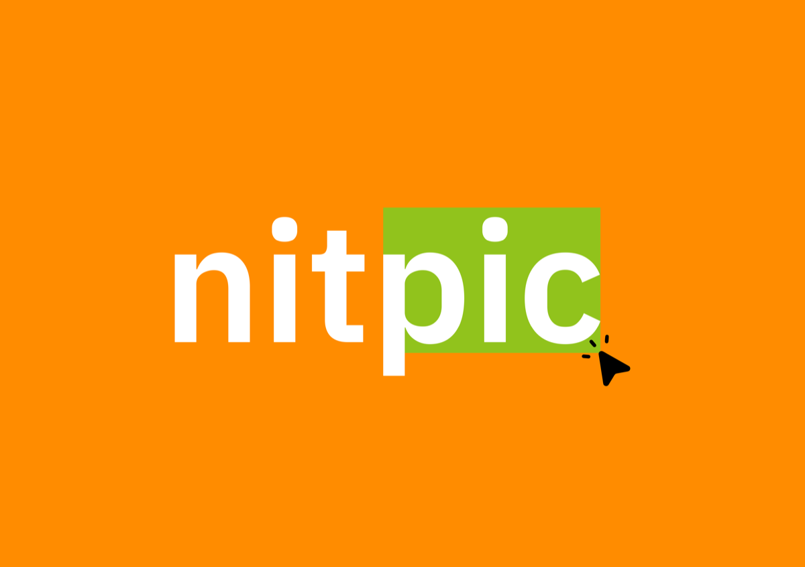

<p align="center">
  
</p>

<h3 align="center">Haz clic en lo que sea. Di qué está mal. Mira cómo Claude lo arregla.</h3>

<p align="center">
  <a href="../LICENSE"></a>
  
  
  <a href="https://buymeacoffee.com/jibrilai"></a>
</p>

<p align="center">
  <a href="../README.md">English</a> ·
  <a href="README.es.md">Español</a> ·
  <a href="README.fr.md">Français</a> ·
  <a href="README.de.md">Deutsch</a> ·
  <a href="README.ja.md">日本語</a> ·
  <a href="README.zh-CN.md">简体中文</a> ·
  <a href="README.ar.md">العربية</a>
</p>

---

**nitpic** conecta tu navegador con [Claude Code](https://claude.com/claude-code). Activa el modo feedback, haz clic en cualquier elemento de cualquier página — `localhost` o producción —, escribe qué debería cambiar y envíalo. Tu comentario, una captura recortada y el HTML del elemento aterrizan dentro de tu sesión de Claude Code **como si los hubieras escrito allí**, y Claude se pone manos a la obra.

Hecho para diseñadores, desarrolladores y *vibe coders* que revisan su app en el navegador pero la arreglan en la terminal.

## ✨ Características

- **🎯 Señala el problema** — resalta cualquier elemento al pasar el ratón o arrastra para seleccionar una región; nitpic captura el selector CSS, una captura de pantalla y el HTML por ti
- **⚡ Entrega instantánea** — el feedback llega a tu terminal en un segundo (tmux e iTerm2 reciben inyección real de teclado; en el resto llega en el siguiente turno de Claude)
- **🎛 Tú eliges la sesión** — escribe `/nitpic` en la sesión de Claude Code que deba escuchar; ejecútalo en otra para mover la conexión
- **📚 Revisiones por lotes** — acumula comentarios entre páginas y pestañas y envíalos como un solo mensaje, agrupados por página
- **🫧 Panel flotante** — arrastrable, plegable a una píldora, nunca comprime tu viewport ni dispara breakpoints responsive
- **🔒 Solo local** — sin cuentas, sin servidores, sin telemetría; todo se queda en tu máquina
- **🪄 Configuración sin fricción** — el emparejamiento es automático; nunca copias un código ni tocas un archivo de configuración

## 🚀 Inicio rápido

**1. Instala la extensión de Chrome** — *(enlace a la Web Store muy pronto; mientras tanto: `chrome://extensions` → Modo desarrollador → Cargar descomprimida → `extension/dist`)*

**2. Instala el plugin de Claude Code** — pega esto en cualquier sesión:

```
/plugin marketplace add jibril4000/nitpic
/plugin install nitpic@nitpic
```

**3. Conecta** — en la sesión que deba recibir el feedback:

```
/nitpic
```

**4. Critica** — haz clic en el icono de nitpic en la página que estés revisando, pulsa **Start feedback**, haz clic en lo que sea, escribe un comentario y **Send**. Ese es todo el ciclo.

## 🧠 Cómo funciona

| Tu terminal | Entrega |
| --- | --- |
| tmux | ⚡ instantánea — inyectada en el panel exacto |
| iTerm2 | ⚡ instantánea — inyectada vía la API de sesiones |
| cualquier otra | ⏭ en los límites de turno — llega cuando Claude termina su respuesta actual, con una notificación de escritorio |

Las capturas y fragmentos HTML se escriben en `<proyecto>/.feedback/` (añadido a `.gitignore` automáticamente). Si ninguna sesión escucha, el feedback se encola en disco y se entrega cuando una se conecta.

## 🔒 Privacidad y seguridad

Todo es local: el conmutador solo escucha en `127.0.0.1`, y un token de emparejamiento (intercambiado automáticamente) impide que páginas web arbitrarias le hablen. La extensión no recopila datos.

## 🗺 Hoja de ruta

- [x] Claude Code
- [ ] Cursor
- [ ] Codex
- [ ] Gemini CLI
- [ ] Inyección en la terminal de VS Code
- [ ] Vista previa de tamaños de dispositivo
- [ ] Chrome Web Store + emparejamiento sin token

## ☕ Apoya el proyecto

Si nitpic te ahorra diez idas y vueltas, [invítame un café](https://buymeacoffee.com/jibrilai). Hecho por [Jibril](https://linkedin.com/in/jibril-ai).

## 📝 Licencia

[MIT](../LICENSE)
